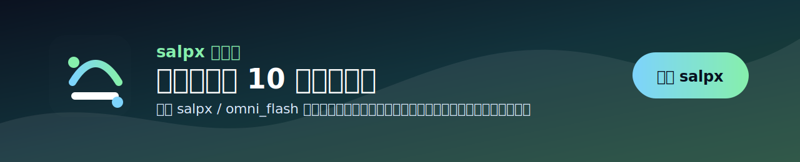
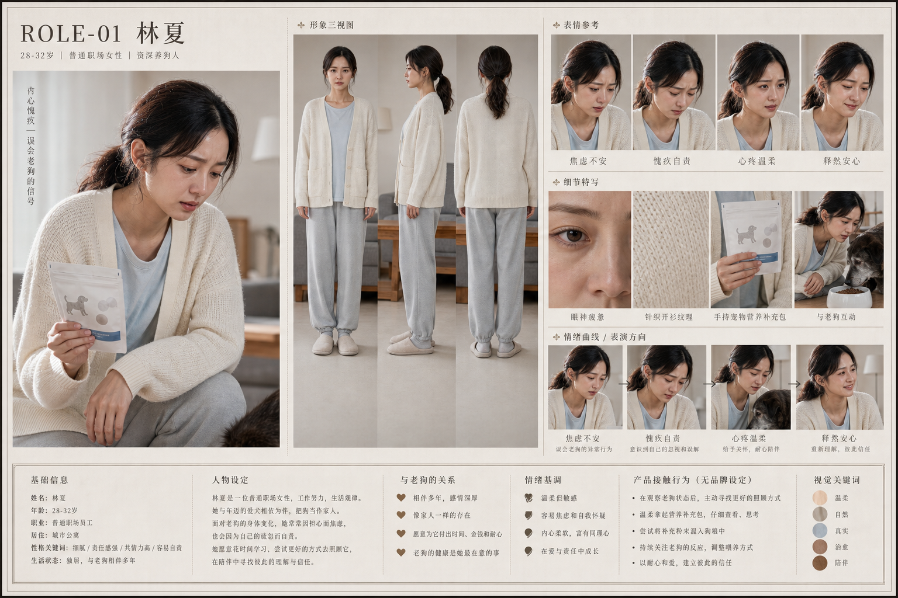
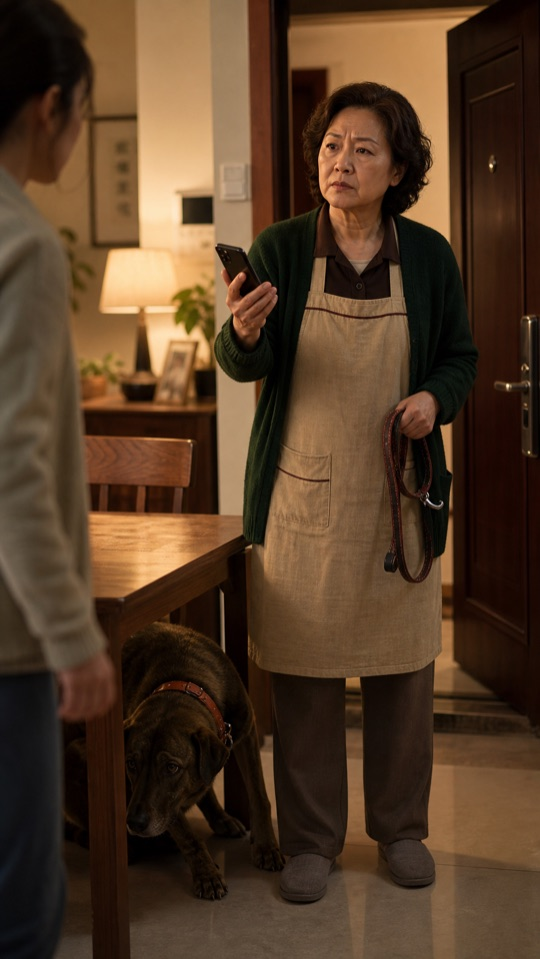
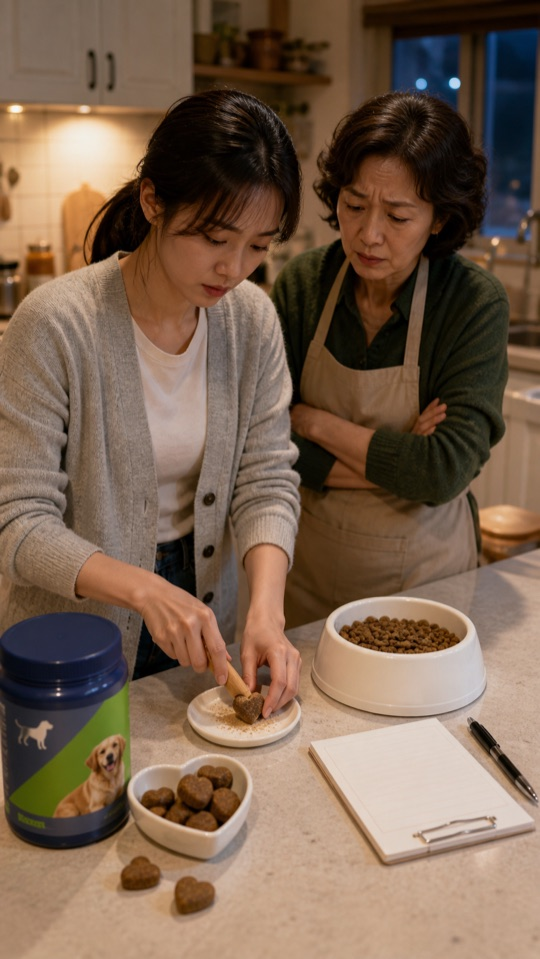
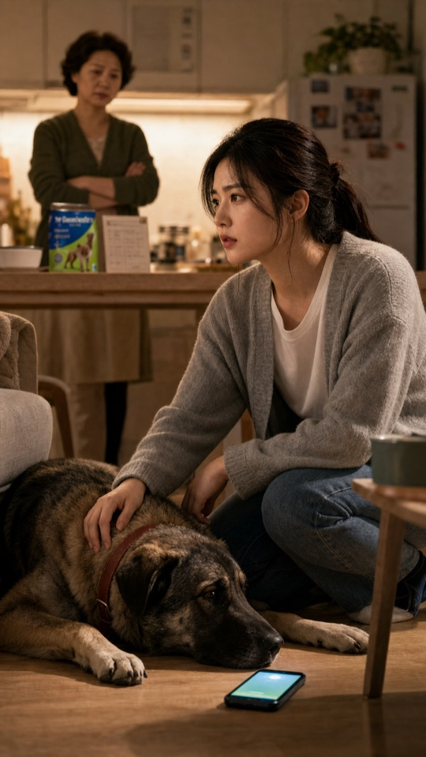
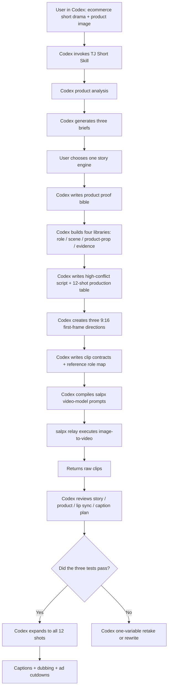

# TJ Short

Codex + salpx relay ecommerce short-drama skill: use Codex to generate product analysis, briefs, scripts, storyboards, first frames, prompts, captions, manifests, and delivery checks, then use salpx relay for `gpt-image-2` image generation and omni, Seedance2, Veo, and other video execution.

[中文版本](README.md)

<a href="https://www.salpx.com">
  
</a>

## Overview

TJ Short is a public-safe Codex Skill template for ecommerce short dramas. It is not only a writing framework and not only a video API wrapper. It lets Codex move a product image through a complete production chain:

product analysis -> three briefs -> product proof bible -> four libraries plus shot table (role / scene / product-prop / evidence + 12-shot production table) -> character dossier boards -> 9:16 first frames, optionally generated through salpx `gpt-image-2` -> `salpx` video-model prompts (omni fixed at 10 seconds; Seedance2/Veo follow model rules) -> captions and ad cutdown plan.

The split is clear:

- **Codex is the production brain**: judgment, writing, files, prompts, manifests, captions, reviews, and privacy checks.
- **salpx is the image/video execution relay**: runs `gpt-image-2` for storyboards and first frames when needed, then takes clean first frames and script-locked prompts into `omni_flash`, Seedance2, Veo, or another selected video model and returns raw clips.

## Skill Card

| Item | Description |
|---|---|
| One-line positioning | A Codex Skill for generating ecommerce short-drama projects and executing image-to-video through salpx |
| Input | Product image, product name, audience, product action, proof, CTA |
| Output | briefs, product proof bible, episode script, storyboard, first frames, video-model prompts, caption plan, ad cutdowns |
| First-stage success | Validate 1 main episode plus 2 ad cutdowns before expanding into a series |
| Recommended video route | `salpx / omni_flash`, Seedance2, Veo; omni is fixed at 10 seconds |
| Not for | Pure hard ads, products without demonstrable action, projects without proof, or claims promising medical/financial results |

It is useful for:

- pet products, consumer products, and tool products
- teams validating 1 main episode plus 2 ad cutdowns
- creators who want Codex to turn product assets into structured short-drama project files
- creators using salpx omni, Seedance2, or Veo for first-frame image-to-video
- teams turning ecommerce short-drama production into a reusable skill or SOP

Core rule:

> The product is not the hero. Characters, pets, relationships, and consequences come first. The product proves the truth later.

## Version Highlights

| Version | Key updates |
|---|---|
| v0.8.28 | Added grid-first cost control: generate one 4x3 contact sheet first, then auto-cut 12 independent 9:16 first frames; do not generate 12 standalone first frames upfront unless explicitly requested or the grid/cut workflow fails. |
| v0.8.27 | Corrected the Seedance2 visible-person first-frame flow: from the grid/first-frame stage, generate `face_pencil` strong / medium / `blur_feature` candidates for the same shot, precheck them one by one, then choose the passing frame with the most complete face and acting information; no-person product frames are only for API smoke tests or product-evidence shots. |
| v0.8.26 | Added production-ready salpx API flow: `gpt-image-2` image generation, `omni_flash`, `seedance-2-mini-480p`, and Veo video generation, plus a reusable client for submit, poll, and download. |
| v0.8.25 | Added Volcengine Seedance2 prompt rules and model routing: Seedance2, omni, and Veo use separate prompt shapes, duration rules, references, and review strategies. |
| v0.8.24 | Added Seedance2 filed role asset chain: character dossier board -> provider filing -> filed asset ID -> video generation with the filed asset; clarified that a watermark is not filing proof. |
| v0.8.23 | Added character dossier board workflow: main portrait, three views, expression sheet, wardrobe/material details, product-contact details, and concise info panel as the standard role-subject example. |
| v0.8.22 | Added AniShort-style subject libraries: role, scene, product/prop, and evidence libraries before the 12-shot production table. |
| v0.8.22 | Added Seedance2 visible-face lessons: `face_pencil` and `blur_feature` before changing shot design. |
| v0.8.22 | Added startup gate, salpx.com registration, and API Key setup reminders. |

Full history: [docs/changelog.md](docs/changelog.md)

## Why Try It

- It is a Codex Skill, not just documentation
- Codex handles strategy, scripts, storyboards, first frames, prompts, and delivery checklists
- salpx executes `gpt-image-2` image generation and image-to-video clips from Codex-generated first frames and prompts
- Avoids the weak "pain point -> product -> happy customer -> CTA" ad pattern
- Builds conflict, misunderstanding, and relationship pressure before product explanation
- Uses product as evidence: records, actions, procedures, behavior changes, or key objects
- Tests three clips first: hook, product evidence, ending hook
- Uses grid-first first-frame production: one 4x3 contact sheet -> auto-cut 12 independent 9:16 frames; standalone frames are for failed cells, selected retakes, or trial-clip polish only
- Treats omni as fixed 10-second generation; Seedance2 and Veo follow selected model rules
- Separates video models: Seedance2 uses ordered media labels and subject definitions; omni describes motion after the first frame; Veo uses cinematic scene/camera language
- For Seedance2 visible faces, prefers character dossier board -> provider filing -> filed asset reference; a watermark is not filing proof
- Seedance2 visible-human projects must create dossier deliverables first: `角色主体库.md`, `人物备案板需求.md`, and `Seedance2参考包计划.md`
- Uses strict phases: startup only diagnoses and offers A/B/C; after selection, generate project files and dossier deliverables before storyboard grids, video prompts, or submissions
- Keeps character dossier boards for design, filing, and review; for video generation, extracts face close-up, full/half-body wardrobe, scene, product, motion, and audio references
- Seedance2 official first frames/grids should not downgrade the whole image to manga/anime. For each visible-person shot, generate `face_pencil` strong, `face_pencil` medium, and `blur_feature` candidates, precheck them one by one, then choose the passing frame with the most complete face and acting information.
- No-person product frames are only for API smoke tests or product-evidence shots; they must not silently replace visible-face acting shots.
- Seedance2 prompts must refer to media by order, such as `图片1`, `视频1`, and `音频1`, rather than using asset IDs as character names
- If filing is unavailable or still rejected, uses `face_pencil` or `blur_feature` virtual-character repair before changing shot design
- Keeps pacing decisions in post-production
- Includes privacy and key-safety checks before public release

## Seedance2 Visible Faces

Short-drama clips often need facial acting. Do not default to faceless crops.

Hard gate: create role dossier deliverables before first-frame grids and video prompts. A generic reference asset table is not enough.

Workflow gate:

1. Startup phase: product diagnosis and A/B/C only.
2. After brief selection: generate product proof bible, role subject library, character dossier spec, and Seedance2 reference package plan.
3. After the role gate passes: generate 12-shot storyboard, 4x3 first-frame grid, cut report, and model-specific prompt packs.

Cost gate: do not generate 12 standalone first frames upfront. Standard flow is `4x3 grid -> cut 12 frames -> precheck -> retake only failed cells or selected trial cells`.

For Seedance2 visible-person official first frames, start the candidate workflow at the grid/first-frame stage:

1. If salpx or the selected provider supports role/person filing, file the character dossier board first, then use the provider-scoped filed asset ID for Seedance2 generation.
2. Keep the original filed platform reference; downloading and re-uploading may lose filing status.
3. Extract single-person references from the dossier board: `图片1 = face close-up`, `图片2 = full/half-body wardrobe`, plus scene, product, motion, or audio references.
4. Generate three candidates for the same shot: `face_pencil_strong`, `face_pencil_medium`, and `blur_feature` (blurred main frame + facial-feature sheet).
5. Precheck each candidate through Seedance2 or a controlled one-shot test.
6. Among passing candidates, choose the one with the most complete face information and clearest acting; do not resubmit a failed frame unchanged.
7. Define the subject in prompt text: `将图片1中的面部特征、图片2中的服装造型定义为林夏`, then keep using the same role label.

Forbidden default: turning official first frames into full manga, anime, illustration, or commercial storyboard style when face review is risky. That is only a preview style board, not the production first frame.

No-person product frames are valid only for product-evidence shots or salpx API smoke tests. They are not the default production fallback for rejected visible-face acting shots.

Note: a LibTV-style watermark is not filing proof, and real filing IDs should not be committed to public repos. Public examples should use placeholders such as `asset-YYYYMMDDHHMMSS-xxxxx`.

Full SOP: [docs/seedance2-face-compliance.md](docs/seedance2-face-compliance.md)

## How It Compares

| Compared With | Where It Is Stronger | Where TJ Short Fits Better |
|---|---|---|
| OnlyShot | Deeper, heavier ecommerce short-drama production system | Lighter public Codex install for fast product validation |
| short-drama | Stronger for entertainment series and general drama structure | More focused on conversion, product proof, and ad cutdowns |
| Emily2040/seedance-2.0 | Stronger video generation discipline and state tracking | Brings those ideas into a Codex ecommerce delivery chain |
| salpx video models | Execute omni, Seedance2, Veo, and other image-to-video generation | Codex handles judgment, scripts, prompts, manifests, and checks |
| Editing tools | Better for subtitles, dubbing, compositing, publishing | Better for creating the ecommerce short-drama structure from product assets |

Detailed fair comparison: [docs/comparison.md](docs/comparison.md)

## Case Preview

Sanitized pet ecommerce short-drama example. These first frames represent the hook, product evidence, and ending hook.

### Character Dossier Board

Key role subjects should not rely on a single attractive portrait. A reusable character dossier board locks the main portrait, front/side/back views, expression set, wardrobe/material details, product-contact behavior, and visual keywords. Later first-frame, storyboard, and video prompts should reference this role subject instead of reinventing the character in every shot.



| Hook: send-away pressure | Product evidence | Ending hook |
|---|---|---|
|  |  |  |

Example script: [examples/xiderdl-lucky/ep01-high-conflict.md](examples/xiderdl-lucky/ep01-high-conflict.md)

## Deliverables

| Deliverable | Purpose | Required |
|---|---|---|
| Product proof bible | Defines user, product action, proof, and claim boundaries | Yes |
| Three briefs | Lets the team choose the story engine before writing scripts | Yes |
| Four libraries plus shot table | Role, scene, product/prop, evidence libraries, and a 12-shot production table | Yes |
| Character dossier boards | Lock key roles with main portrait, three views, expression sheet, wardrobe/materials, and product-contact behavior | Yes |
| Seedance2 filed asset table | Tracks fictional role filing status, filed asset ID placeholder, board version, and provider scope | Required for Seedance2 visible-face routes |
| High-conflict episode script | 60-90 second episode with a strong first 5 seconds | Yes |
| 12-shot production table | Each shot references subject libraries and focuses on action, emotion, camera, and dialogue | Yes |
| Three test first frames | Validates hook, product proof, and ending hook | Yes |
| Image-to-video prompts | Script-locked prompts for salpx video models | Yes |
| Clip contracts | Defines what each clip can and cannot do | Yes |
| Reference role map | Separates first frame, product image, caption, and video reference duties | Yes |
| Generation manifest | Tracks model, frame, prompt, status, and output path | Yes |
| Voiceover and caption list | Source of truth for post-production subtitles | Yes |
| Caption plan | Ensures Omni raw clips receive subtitles in post | Yes |
| Ad cutdown scripts | 35-60 second paid-media cuts from the main episode | Recommended |
| Release scorecard | Decides publish, review-only, or rewrite | Recommended |

## Workflow Architecture



## Environment

| Item | Requirement |
|---|---|
| Codex | Install and run the TJ Short Skill |
| Git | Clone and version control |
| Python | Python 3.9+ |
| Python dependency | `requests` |
| Video service | salpx relay |
| Recommended model | Current priority: `seedance-2-mini-480p`; optional: `seedance-2-fast`, `omni_flash`, Veo variants |
| Aspect ratio | 9:16 |
| Clip duration | omni fixed at 10 seconds; Seedance2/Veo follow model rules |
| Caption strategy | No burned-in subtitles during generation; add captions in post |

## Repository Contents

| Path | Description |
|---|---|
| `skill/SKILL.md` | Skill file that can be copied into the Codex skills directory |
| `README.md` | Full Chinese documentation |
| `README.en.md` | Full English documentation |
| `docs/comparison.md` | Fair comparison with OnlyShot, short-drama, Emily2040/seedance-2.0, salpx, and editing tools |
| `docs/changelog.md` | Version changelog |
| `docs/methodology.md` | Ecommerce short-drama methodology |
| `docs/privacy-and-release.md` | Public-release privacy and key checklist |
| `docs/seedance2-face-compliance.md` | Seedance2 visible-face, face_pencil, and blur_feature compliance notes |
| `docs/salpx-api-production.md` | salpx API guide for gpt-image-2 image generation and omni/Seedance2/Veo video generation |
| `examples/xiderdl-lucky/` | Sanitized sample script and screenshots |
| `prompts/omni-fixed-10s-template.md` | salpx / omni_flash fixed 10-second prompt template |
| `scripts/salpx_production_client.py` | Generic salpx image/video production client |
| `scripts/submit_salpx_omni_i2v.py` | Legacy omni-only image-to-video submission helper |

## Installation

### Option A: Install As A Codex Skill

```bash
git clone https://github.com/tttg2010/tj-short.git
mkdir -p ~/.codex/skills/tj-short
cp tj-short/skill/SKILL.md ~/.codex/skills/tj-short/SKILL.md
```

After installing or updating the Skill, restart Codex. Otherwise Codex may still use an old cached Skill:

```text
重新启动codex！
重新启动codex！
重新启动codex！
```

To fully test video generation from Codex, register at [salpx.com](https://www.salpx.com), get an API Key, and put it into your local `.env`:

```env
SALPX_API_KEY=your_salpx_api_key
SALPX_BASE_URL=https://www.salpx.com/v1
```

Without a salpx API Key, Codex can still generate product analysis, scripts, storyboards, first-frame prompts, and manifests, but it cannot submit salpx image or video jobs from Codex.

Then say in Codex:

```text
短剧带货启动
```

Or:

```text
Use TJ Short to turn this product image into an ecommerce short-drama project.
```

### Option B: Use The Scripts And Templates Only

```bash
git clone https://github.com/tttg2010/tj-short.git
cd tj-short
python3 -m pip install requests
cp .env.example .env
```

Register at [salpx.com](https://www.salpx.com), get an API Key, and fill in your local `.env` by following `.env.example`. Keep real keys local only.

Never commit real keys. `.env` is ignored by git.

## Usage SOP

### Step 0: Start Inside Codex

Recommended starter:

```text
短剧带货启动
```

After Codex gives A/B/C briefs, copy the next step:

```text
短剧带货，选 A，视频模型 salpx / seedance-2-mini-480p（可选 salpx / omni_flash，salpx / seedance-2-fast），产品是：your product in one sentence
```

Codex should analyze the product and produce three briefs first. It should not jump straight into a full script.

Startup gate:

- When the user says `短剧带货启动`, Codex must not immediately generate a full production package.
- If no product image or product information is provided, Codex must ask for the product first. It must not invent generic workplace, fashion, or relationship examples.
- Even when the user says "generate video", follow this order first: product diagnosis -> three briefs -> user chooses A/B/C.
- Full salpx video submission requires registering at [salpx.com](https://www.salpx.com) and putting the API Key into the local `.env`.

### Step 1: Codex Product Diagnosis

Answer:

- What are you selling?
- Who is it for?
- What product action can be shown?
- What proof makes it believable?

If product action and proof are unclear, do not generate video yet.

### Step 2: Write Three Briefs

Each brief should include:

- story engine
- character relationship
- first 5-second crisis
- misunderstanding and truth
- product evidence position
- main selling point
- CTA
- AI video feasibility

Only after one brief is selected should you write the full episode.

### Step 3: Codex Writes The High-Conflict Episode

Recommended rhythm:

```text
0-5s: external pressure or relationship threat
5-20s: dialogue conflict
20-40s: misunderstanding escalates
40-55s: truth begins to appear
55-70s: product enters as evidence
70-90s: relationship turn + next hook
```

### Step 4: Codex Creates Three First Frames

Do not generate the full episode immediately. Create:

- `HC-01`: strong opening hook
- `HC-09`: product evidence
- `HC-12`: ending hook

First frames must be clean 9:16 full-frame images with no subtitles, no inset, no white border, and no blurred background extension.

### Step 5: Codex Compiles Prompts And Submits Three Test Clips

If you need to generate storyboards, first frames, or product-proof images first, use `gpt-image-2`:

```bash
python3 scripts/salpx_production_client.py --env .env image \
  --model gpt-image-2 \
  --prompt "vertical 9:16 ecommerce short-drama first frame..." \
  --size 1024x1792 \
  --out-dir outputs/images \
  --name ep01-shot01
```

When using `omni_flash`, use the fixed 10-second rule:

```json
{
  "model": "omni_flash",
  "duration": 10,
  "aspect_ratio": "9:16"
}
```

The generic helper is a local execution example. In the full Codex workflow, Codex should first generate prompts, manifests, and checklists before submitting or guiding submission:

```bash
python3 scripts/salpx_production_client.py --env .env video \
  --model omni_flash \
  --image path/to/first-frame.png \
  --prompt "10-second vertical 9:16 image-to-video..." \
  --duration 10 \
  --out outputs/shot.mp4
```

For `seedance-2-mini-480p`, use the API model name:

```bash
python3 scripts/salpx_production_client.py --env .env video \
  --model seedance-2-mini-480p \
  --image path/to/first-frame.png \
  --prompt "7-second vertical 9:16 image-to-video..." \
  --size 480x854 \
  --duration 7 \
  --out outputs/shot-seedance.mp4
```

For Veo, use the actual model ID shown in the salpx console. If that route does not support image-to-video, remove `--image`, submit text-to-video, and record `generation_mode=text_to_video` in the manifest.

The older omni-only helper remains available:

```bash
python3 scripts/submit_salpx_omni_i2v.py \
  --env .env \
  --first-frame path/to/first-frame.png \
  --prompt-file path/to/prompt.txt \
  --output outputs/shot.mp4
```

### Step 6: Codex Reviews Clips

Check:

- Did the clip complete its narrative job?
- Did it reveal later information too early?
- Did the product become a hard ad?
- Did it create subtitles, garbled text, inset frames, or borders?
- Did dialogue belong to the right speaker?
- Does it need post dubbing?

Only expand to all 12 shots after the three tests pass.

### Step 7: Codex Prepares Final Delivery

The final episode should include:

- subtitles
- dubbing or usable original audio
- low-mixed original sound
- preview frames
- release score
- ad cutdowns

Raw clips without subtitles are not final publishable videos.

## Star Rating Criteria

If a user can complete these actions within 30 minutes, the skill deserves 5 stars:

| Rating | Standard |
|---|---|
| 1/5 | Concept only; unclear how to start inside Codex |
| 2/5 | Codex can write a script but cannot enter video production |
| 3/5 | Codex can create first frames and prompts but lacks review criteria |
| 4/5 | Codex can run three test clips and knows how to retake failures |
| 5/5 | Codex can go from product image to main episode, cutdowns, captions, and release checks |

## References

This workflow openly credits:

- **OnlyShot**: ecommerce short-drama thinking, product evidence, projectized delivery
- **short-drama**: episode structure, storyboard, video-production workflow
- **Emily2040/seedance-2.0**: clip contracts, project state capsule, reference role map, one-variable retake

This is not an official distribution of those projects. It is a public-safe reusable practice template.

## Public Safety

This repository does not include:

- real API keys
- `.env`
- private product source images
- API responses
- task IDs
- download URLs
- local absolute paths
- generated video files

Read: [docs/privacy-and-release.md](docs/privacy-and-release.md)
