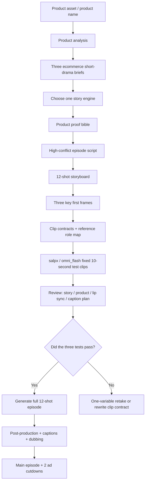

# TJ Short

Ecommerce short-drama skill workflow: make the audience care about a person, pet, relationship, or consequence first, then let the product become proof inside the story.

[中文版本](README.md)

<a href="https://www.salpx.com">
  
</a>

## Overview

TJ Short is a public-safe production template for ecommerce short dramas. It does not wrap ad copy in a plot. It organizes story design, product proof, image-to-video prompts, caption planning, and release checks into a reusable SOP.

## Skill Card

| Item | Description |
|---|---|
| One-line positioning | Workflow for ecommerce short-drama scripts, first frames, image-to-video clips, and delivery checks |
| Input | Product image, product name, audience, product action, proof, CTA |
| Output | briefs, product proof bible, episode script, storyboard, first frames, Omni prompts, caption plan, ad cutdowns |
| First-stage success | Validate 1 main episode plus 2 ad cutdowns before expanding into a series |
| Recommended video route | `salpx / omni_flash`, fixed 10-second clips |
| Not for | Pure hard ads, products without demonstrable action, projects without proof, or claims promising medical/financial results |

It is useful for:

- pet products, consumer products, and tool products
- teams validating 1 main episode plus 2 ad cutdowns
- creators using `salpx / omni_flash` for first-frame image-to-video
- teams turning ecommerce short-drama production into a reusable skill or SOP

Core rule:

> The product is not the hero. Characters, pets, relationships, and consequences come first. The product proves the truth later.

## Why Try It

- Avoids the weak "pain point -> product -> happy customer -> CTA" ad pattern
- Builds conflict, misunderstanding, and relationship pressure before product explanation
- Uses product as evidence: records, actions, procedures, behavior changes, or key objects
- Tests three clips first: hook, product evidence, ending hook
- Treats `salpx / omni_flash` as fixed 10-second generation
- Keeps pacing decisions in post-production
- Includes privacy and key-safety checks before public release

## Case Preview

Sanitized pet ecommerce short-drama example. These first frames represent the hook, product evidence, and ending hook.

| Hook: send-away pressure | Product evidence | Ending hook |
|---|---|---|
|  |  |  |

Example script: [examples/xiderdl-lucky/ep01-high-conflict.md](examples/xiderdl-lucky/ep01-high-conflict.md)

## Deliverables

| Deliverable | Purpose | Required |
|---|---|---|
| Product proof bible | Defines user, product action, proof, and claim boundaries | Yes |
| Three briefs | Lets the team choose the story engine before writing scripts | Yes |
| High-conflict episode script | 60-90 second episode with a strong first 5 seconds | Yes |
| 12-shot storyboard | Locks narrative job, visuals, and product placement | Yes |
| Three test first frames | Validates hook, product proof, and ending hook | Yes |
| Image-to-video prompts | Script-locked prompts for `salpx / omni_flash` | Yes |
| Clip contracts | Defines what each clip can and cannot do | Yes |
| Reference role map | Separates first frame, product image, caption, and video reference duties | Yes |
| Generation manifest | Tracks model, frame, prompt, status, and output path | Yes |
| Voiceover and caption list | Source of truth for post-production subtitles | Yes |
| Caption plan | Ensures Omni raw clips receive subtitles in post | Yes |
| Ad cutdown scripts | 35-60 second paid-media cuts from the main episode | Recommended |
| Release scorecard | Decides publish, review-only, or rewrite | Recommended |

## Workflow Architecture



## Environment

| Item | Requirement |
|---|---|
| Git | Clone and version control |
| Python | Python 3.9+ |
| Python dependency | `requests` |
| Video service | salpx relay |
| Recommended model | `omni_flash` |
| Aspect ratio | 9:16 |
| Clip duration | Fixed 10 seconds |
| Caption strategy | No burned-in subtitles during generation; add captions in post |

## Installation

```bash
git clone https://github.com/tttg2010/tj-short.git
cd tj-short
python3 -m pip install requests
cp .env.example .env
```

Fill in your local `.env` by following `.env.example`. Keep real keys local only.

Never commit real keys. `.env` is ignored by git.

## Usage SOP

### Step 1: Product Diagnosis

Answer:

- What are you selling?
- Who is it for?
- What product action can be shown?
- What proof makes it believable?

If product action and proof are unclear, do not generate video yet.

### Step 2: Write Three Briefs

Each brief should include:

- story engine
- character relationship
- first 5-second crisis
- misunderstanding and truth
- product evidence position
- main selling point
- CTA
- AI video feasibility

Only after one brief is selected should you write the full episode.

### Step 3: Write The High-Conflict Episode

Recommended rhythm:

```text
0-5s: external pressure or relationship threat
5-20s: dialogue conflict
20-40s: misunderstanding escalates
40-55s: truth begins to appear
55-70s: product enters as evidence
70-90s: relationship turn + next hook
```

### Step 4: Create Three First Frames

Do not generate the full episode immediately. Create:

- `HC-01`: strong opening hook
- `HC-09`: product evidence
- `HC-12`: ending hook

First frames must be clean 9:16 full-frame images with no subtitles, no inset, no white border, and no blurred background extension.

### Step 5: Submit Three Test Clips

Use the fixed 10-second rule:

```json
{
  "model": "omni_flash",
  "duration": 10,
  "aspect_ratio": "9:16"
}
```

Generic helper:

```bash
python3 scripts/submit_salpx_omni_i2v.py \
  --env .env \
  --first-frame path/to/first-frame.png \
  --prompt-file path/to/prompt.txt \
  --output outputs/shot.mp4
```

### Step 6: Review Clips

Check:

- Did the clip complete its narrative job?
- Did it reveal later information too early?
- Did the product become a hard ad?
- Did it create subtitles, garbled text, inset frames, or borders?
- Did dialogue belong to the right speaker?
- Does it need post dubbing?

Only expand to all 12 shots after the three tests pass.

### Step 7: Final Delivery

The final episode should include:

- subtitles
- dubbing or usable original audio
- low-mixed original sound
- preview frames
- release score
- ad cutdowns

Raw clips without subtitles are not final publishable videos.

## Star Rating Criteria

If a user can complete these actions within 30 minutes, the skill deserves 5 stars:

| Rating | Standard |
|---|---|
| 1/5 | Concept only; unclear how to start |
| 2/5 | Can write a script but cannot enter video production |
| 3/5 | Can create first frames and prompts but lacks review criteria |
| 4/5 | Can run three test clips and knows how to retake failures |
| 5/5 | Can go from product image to main episode, cutdowns, captions, and release checks |

## References

This workflow openly credits:

- **OnlyShot**: ecommerce short-drama thinking, product evidence, projectized delivery
- **short-drama**: episode structure, storyboard, video-production workflow
- **Emily2040/seedance-2.0**: clip contracts, project state capsule, reference role map, one-variable retake

This is not an official distribution of those projects. It is a public-safe reusable practice template.

## Public Safety

This repository does not include:

- real API keys
- `.env`
- private product source images
- API responses
- task IDs
- download URLs
- local absolute paths
- generated video files

Read: [docs/privacy-and-release.md](docs/privacy-and-release.md)
