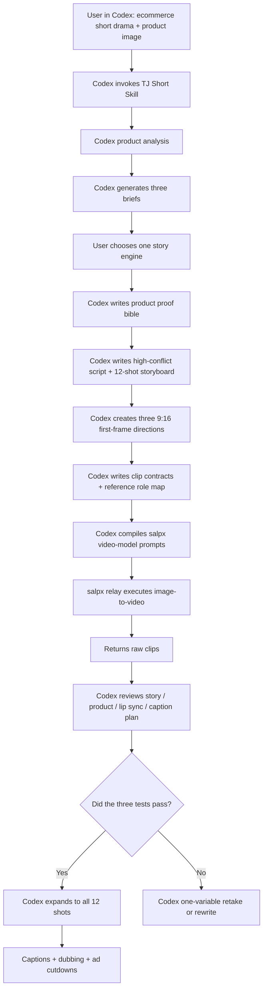

# TJ Short

Codex + salpx relay ecommerce short-drama skill: use Codex to generate product analysis, briefs, scripts, storyboards, first frames, prompts, captions, manifests, and delivery checks, then use salpx relay for omni, Seedance2, Veo, and other image-to-video execution.

[中文版本](README.md)

<a href="https://www.salpx.com">
  
</a>

## Overview

TJ Short is a public-safe Codex Skill template for ecommerce short dramas. It is not only a writing framework and not only a video API wrapper. It lets Codex move a product image through a complete production chain:

product analysis -> three briefs -> product proof bible -> high-conflict script -> 12-shot storyboard -> 9:16 first frames -> `salpx` video-model prompts (omni fixed at 10 seconds; Seedance2/Veo follow model rules) -> captions and ad cutdown plan.

The split is clear:

- **Codex is the production brain**: judgment, writing, files, prompts, manifests, captions, reviews, and privacy checks.
- **salpx is the video execution relay**: takes Codex-generated first frames and script-locked prompts into `omni_flash`, Seedance2, Veo, or another selected model and returns raw clips.

## Skill Card

| Item | Description |
|---|---|
| One-line positioning | A Codex Skill for generating ecommerce short-drama projects and executing image-to-video through salpx |
| Input | Product image, product name, audience, product action, proof, CTA |
| Output | briefs, product proof bible, episode script, storyboard, first frames, video-model prompts, caption plan, ad cutdowns |
| First-stage success | Validate 1 main episode plus 2 ad cutdowns before expanding into a series |
| Recommended video route | `salpx / omni_flash`, Seedance2, Veo; omni is fixed at 10 seconds |
| Not for | Pure hard ads, products without demonstrable action, projects without proof, or claims promising medical/financial results |

It is useful for:

- pet products, consumer products, and tool products
- teams validating 1 main episode plus 2 ad cutdowns
- creators who want Codex to turn product assets into structured short-drama project files
- creators using salpx omni, Seedance2, or Veo for first-frame image-to-video
- teams turning ecommerce short-drama production into a reusable skill or SOP

Core rule:

> The product is not the hero. Characters, pets, relationships, and consequences come first. The product proves the truth later.

## Why Try It

- It is a Codex Skill, not just documentation
- Codex handles strategy, scripts, storyboards, first frames, prompts, and delivery checklists
- salpx executes image-to-video clips from Codex-generated first frames and prompts
- Avoids the weak "pain point -> product -> happy customer -> CTA" ad pattern
- Builds conflict, misunderstanding, and relationship pressure before product explanation
- Uses product as evidence: records, actions, procedures, behavior changes, or key objects
- Tests three clips first: hook, product evidence, ending hook
- Treats omni as fixed 10-second generation; Seedance2 and Veo follow selected model rules
- When Seedance2 rejects visible actor faces, uses `face_pencil` or `blur_feature` virtual-character repair before falling back to faceless shots
- Keeps pacing decisions in post-production
- Includes privacy and key-safety checks before public release

## Seedance2 Visible Faces

Short-drama clips often need facial acting. Do not default to faceless crops.

If Seedance2 flags a realistic first frame as possible real-person content, use this escalation:

1. `face_pencil`: stylize only face regions with colored-pencil/sketch treatment while keeping body, wardrobe, action, and scene photographic.
2. `blur_feature`: blur face regions in the main composition image and provide a separate facial-feature sheet for the fictional virtual character.
3. If needed, add character three-views or a design board.

Full SOP: [docs/seedance2-face-compliance.md](docs/seedance2-face-compliance.md)

## How It Compares

| Compared With | Where It Is Stronger | Where TJ Short Fits Better |
|---|---|---|
| OnlyShot | Deeper, heavier ecommerce short-drama production system | Lighter public Codex install for fast product validation |
| short-drama | Stronger for entertainment series and general drama structure | More focused on conversion, product proof, and ad cutdowns |
| Emily2040/seedance-2.0 | Stronger video generation discipline and state tracking | Brings those ideas into a Codex ecommerce delivery chain |
| salpx video models | Execute omni, Seedance2, Veo, and other image-to-video generation | Codex handles judgment, scripts, prompts, manifests, and checks |
| Editing tools | Better for subtitles, dubbing, compositing, publishing | Better for creating the ecommerce short-drama structure from product assets |

Detailed fair comparison: [docs/comparison.md](docs/comparison.md)

## Case Preview

Sanitized pet ecommerce short-drama example. These first frames represent the hook, product evidence, and ending hook.

| Hook: send-away pressure | Product evidence | Ending hook |
|---|---|---|
|  |  |  |

Example script: [examples/xiderdl-lucky/ep01-high-conflict.md](examples/xiderdl-lucky/ep01-high-conflict.md)

## Deliverables

| Deliverable | Purpose | Required |
|---|---|---|
| Product proof bible | Defines user, product action, proof, and claim boundaries | Yes |
| Three briefs | Lets the team choose the story engine before writing scripts | Yes |
| High-conflict episode script | 60-90 second episode with a strong first 5 seconds | Yes |
| 12-shot storyboard | Locks narrative job, visuals, and product placement | Yes |
| Three test first frames | Validates hook, product proof, and ending hook | Yes |
| Image-to-video prompts | Script-locked prompts for salpx video models | Yes |
| Clip contracts | Defines what each clip can and cannot do | Yes |
| Reference role map | Separates first frame, product image, caption, and video reference duties | Yes |
| Generation manifest | Tracks model, frame, prompt, status, and output path | Yes |
| Voiceover and caption list | Source of truth for post-production subtitles | Yes |
| Caption plan | Ensures Omni raw clips receive subtitles in post | Yes |
| Ad cutdown scripts | 35-60 second paid-media cuts from the main episode | Recommended |
| Release scorecard | Decides publish, review-only, or rewrite | Recommended |

## Workflow Architecture



## Environment

| Item | Requirement |
|---|---|
| Codex | Install and run the TJ Short Skill |
| Git | Clone and version control |
| Python | Python 3.9+ |
| Python dependency | `requests` |
| Video service | salpx relay |
| Recommended model | `omni_flash`, `seedance-2-mini-480p`, Veo variants |
| Aspect ratio | 9:16 |
| Clip duration | omni fixed at 10 seconds; Seedance2/Veo follow model rules |
| Caption strategy | No burned-in subtitles during generation; add captions in post |

## Repository Contents

| Path | Description |
|---|---|
| `skill/SKILL.md` | Skill file that can be copied into the Codex skills directory |
| `README.md` | Full Chinese documentation |
| `README.en.md` | Full English documentation |
| `docs/comparison.md` | Fair comparison with OnlyShot, short-drama, Emily2040/seedance-2.0, salpx, and editing tools |
| `docs/changelog.md` | Version changelog |
| `docs/methodology.md` | Ecommerce short-drama methodology |
| `docs/privacy-and-release.md` | Public-release privacy and key checklist |
| `docs/seedance2-face-compliance.md` | Seedance2 visible-face, face_pencil, and blur_feature compliance notes |
| `examples/xiderdl-lucky/` | Sanitized sample script and screenshots |
| `prompts/omni-fixed-10s-template.md` | salpx / omni_flash fixed 10-second prompt template |
| `scripts/submit_salpx_omni_i2v.py` | Generic image-to-video submission helper |

## Installation

### Option A: Install As A Codex Skill

```bash
git clone https://github.com/tttg2010/tj-short.git
mkdir -p ~/.codex/skills/tj-short
cp tj-short/skill/SKILL.md ~/.codex/skills/tj-short/SKILL.md
```

After installing or updating the Skill, restart Codex. Otherwise Codex may still use an old cached Skill:

```text
重新启动codex！
重新启动codex！
重新启动codex！
```

To fully test video generation from Codex, register at [salpx.com](https://www.salpx.com), get an API Key, and put it into your local `.env`:

```env
SALPX_API_KEY=your_salpx_api_key
SALPX_BASE_URL=https://www.salpx.com/v1
```

Without a salpx API Key, Codex can still generate product analysis, scripts, storyboards, first-frame prompts, and manifests, but it cannot submit image-to-video jobs from Codex.

Then say in Codex:

```text
短剧带货启动
```

Or:

```text
Use TJ Short to turn this product image into an ecommerce short-drama project.
```

### Option B: Use The Scripts And Templates Only

```bash
git clone https://github.com/tttg2010/tj-short.git
cd tj-short
python3 -m pip install requests
cp .env.example .env
```

Register at [salpx.com](https://www.salpx.com), get an API Key, and fill in your local `.env` by following `.env.example`. Keep real keys local only.

Never commit real keys. `.env` is ignored by git.

## Usage SOP

### Step 0: Start Inside Codex

Recommended starter:

```text
短剧带货启动
```

If you already have a product image:

```text
短剧带货，选 A，视频模型选 salpx / omni_flash
```

Codex should analyze the product and produce three briefs first. It should not jump straight into a full script.

### Step 1: Codex Product Diagnosis

Answer:

- What are you selling?
- Who is it for?
- What product action can be shown?
- What proof makes it believable?

If product action and proof are unclear, do not generate video yet.

### Step 2: Write Three Briefs

Each brief should include:

- story engine
- character relationship
- first 5-second crisis
- misunderstanding and truth
- product evidence position
- main selling point
- CTA
- AI video feasibility

Only after one brief is selected should you write the full episode.

### Step 3: Codex Writes The High-Conflict Episode

Recommended rhythm:

```text
0-5s: external pressure or relationship threat
5-20s: dialogue conflict
20-40s: misunderstanding escalates
40-55s: truth begins to appear
55-70s: product enters as evidence
70-90s: relationship turn + next hook
```

### Step 4: Codex Creates Three First Frames

Do not generate the full episode immediately. Create:

- `HC-01`: strong opening hook
- `HC-09`: product evidence
- `HC-12`: ending hook

First frames must be clean 9:16 full-frame images with no subtitles, no inset, no white border, and no blurred background extension.

### Step 5: Codex Compiles Prompts And Submits Three Test Clips

Use the fixed 10-second rule:

```json
{
  "model": "omni_flash",
  "duration": 10,
  "aspect_ratio": "9:16"
}
```

The generic helper is a local execution example. In the full Codex workflow, Codex should first generate prompts, manifests, and checklists before submitting or guiding submission:

```bash
python3 scripts/submit_salpx_omni_i2v.py \
  --env .env \
  --first-frame path/to/first-frame.png \
  --prompt-file path/to/prompt.txt \
  --output outputs/shot.mp4
```

### Step 6: Codex Reviews Clips

Check:

- Did the clip complete its narrative job?
- Did it reveal later information too early?
- Did the product become a hard ad?
- Did it create subtitles, garbled text, inset frames, or borders?
- Did dialogue belong to the right speaker?
- Does it need post dubbing?

Only expand to all 12 shots after the three tests pass.

### Step 7: Codex Prepares Final Delivery

The final episode should include:

- subtitles
- dubbing or usable original audio
- low-mixed original sound
- preview frames
- release score
- ad cutdowns

Raw clips without subtitles are not final publishable videos.

## Star Rating Criteria

If a user can complete these actions within 30 minutes, the skill deserves 5 stars:

| Rating | Standard |
|---|---|
| 1/5 | Concept only; unclear how to start inside Codex |
| 2/5 | Codex can write a script but cannot enter video production |
| 3/5 | Codex can create first frames and prompts but lacks review criteria |
| 4/5 | Codex can run three test clips and knows how to retake failures |
| 5/5 | Codex can go from product image to main episode, cutdowns, captions, and release checks |

## References

This workflow openly credits:

- **OnlyShot**: ecommerce short-drama thinking, product evidence, projectized delivery
- **short-drama**: episode structure, storyboard, video-production workflow
- **Emily2040/seedance-2.0**: clip contracts, project state capsule, reference role map, one-variable retake

This is not an official distribution of those projects. It is a public-safe reusable practice template.

## Public Safety

This repository does not include:

- real API keys
- `.env`
- private product source images
- API responses
- task IDs
- download URLs
- local absolute paths
- generated video files

Read: [docs/privacy-and-release.md](docs/privacy-and-release.md)
