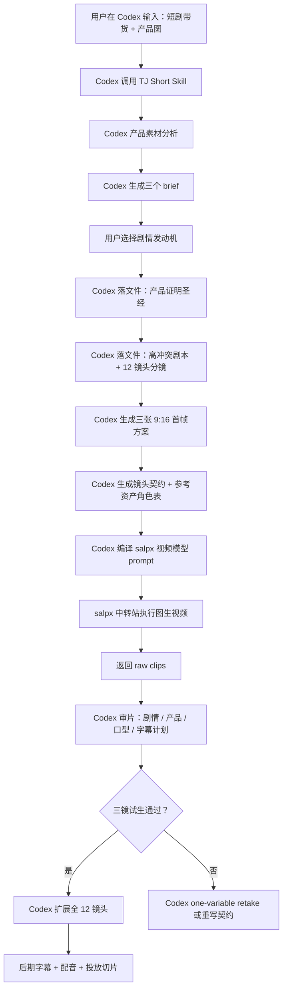

# TJ Short

Codex + salpx 中转站的短剧带货 Skill：在 Codex 里自动完成产品分析、脚本、分镜、首帧、提示词、字幕计划和交付检查，再用 salpx 中转站执行 omni、Seedance2、Veo 等图生视频。

[English Version](README.en.md)

<a href="https://www.salpx.com">
  
</a>

## 项目简介

TJ Short 是一个面向 Codex 的「短剧带货 Skill」公开模板。它的核心不是单纯写剧本，也不是单纯调用视频模型，而是在 Codex 里把短剧带货从产品图一路推进到可执行交付物：

产品分析 -> 三个 brief -> 产品证明圣经 -> 高冲突剧本 -> 12 镜头分镜 -> 9:16 首帧 -> `salpx` 视频模型提示词（omni 固定 10 秒，Seedance2/Veo 按模型规则） -> 字幕与投放切片计划。

这里的分工很明确：

- **Codex 是生产大脑**：负责判断、写作、落文件、提示词、manifest、字幕、复盘和隐私检查。
- **salpx 中转站是视频执行层**：负责把 Codex 生成的干净 9:16 首帧和剧本锁定 prompt 送进 `omni_flash`、Seedance2、Veo 等模型，产出图生视频素材。

## Skill Card

| 项目 | 说明 |
|---|---|
| 一句话定位 | 在 Codex 里自动生成短剧带货项目，并通过 salpx 中转站执行图生视频 |
| 输入 | 产品图、产品名、目标人群、产品动作、可信证据、CTA |
| 输出 | brief、产品证明圣经、单集剧本、分镜、首帧、视频模型提示词、字幕计划、投放切片 |
| 第一阶段成功标准 | 先跑通 1 集正片 + 2 条投放切片，而不是一开始做大系列 |
| 推荐视频路线 | `salpx / omni_flash`、Seedance2、Veo；omni 固定 10 秒 |
| 不适用 | 只有硬广需求、没有产品动作、没有可信证据、想直接承诺疗效或收益的项目 |

它适合：

- 宠物食品、宠物用品、消费品、工具类产品的短剧种草
- 需要先做 1 集正片 + 2 条投放切片验证的团队
- 想在 Codex 里把产品图自动变成短剧项目文件的创作者
- 想用 salpx 的 omni、Seedance2、Veo 做首帧图生视频的创作者
- 想把短剧带货流程沉淀成 Skill、模板或团队 SOP 的项目

核心原则：

> 产品不是主角。人物、宠物、关系和代价先成立，产品只在关键时刻证明真相、改变行为或推动选择。

## 为什么值得试

- 它是 Codex Skill，不只是文档：能指导 Codex 逐步产出真实项目文件
- Codex 负责策略、剧本、分镜、首帧、提示词和交付清单
- salpx 中转站负责把首帧和 prompt 变成 omni、Seedance2 或 Veo 视频素材
- 不写「痛点 -> 产品 -> 满意 -> 下单」的广告小剧情
- 前 30%-50% 先建立冲突、误会和关系压力
- 产品后置为证据位：喂养记录、操作过程、前后行为、关键物证
- 图生视频前先做三镜试生：剧情钩子、产品证据位、结尾追更钩子
- omni 固定 10 秒生成；Seedance2 与 Veo 按模型规则提交，节奏压缩交给后期剪辑
- Seedance2 可见人脸失败时，优先使用 `face_pencil` 或 `blur_feature` 修复虚拟角色参考，不默认改成无脸镜头
- 公开发布前默认做 key、隐私路径、任务响应和大文件检查

## Seedance2 可见人脸

短剧镜头需要人脸表演时，不建议直接裁掉脸。

如果 Seedance2 把高拟真首帧判断为可能真人，可按以下顺序处理：

1. `face_pencil`：只把脸部做彩铅/手绘化，身体、服装、动作和场景保持摄影质感。
2. `blur_feature`：主图模糊脸部保留构图，另给五官特写图补足虚拟角色特征。
3. 仍失败时，再补角色三视图或设定板。

详细 SOP 见：[docs/seedance2-face-compliance.md](docs/seedance2-face-compliance.md)

## 和其他项目 / Skill 的区别

| 对比对象 | 它更强的地方 | TJ Short 更适合的地方 |
|---|---|---|
| OnlyShot | 更完整、更重的短剧带货体系和复盘经验 | 更轻量，适合公开安装到 Codex 里快速跑一个产品验证 |
| short-drama | 更擅长娱乐短剧、系列剧情和通用分镜 | 更聚焦带货转化、产品证据和投放切片 |
| Emily2040/seedance-2.0 | 更擅长视频生成纪律、镜头契约、状态胶囊 | 把这些方法前置到 Codex 的带货项目交付链路里 |
| salpx 视频模型 | 执行 omni、Seedance2、Veo 等图生视频 | Codex 负责判断、脚本、提示词、manifest 和交付检查 |
| 剪辑工具 | 更擅长字幕、配音、合成和发布 | 更擅长从产品图开始搭短剧带货结构 |

详细公平对比见：[docs/comparison.md](docs/comparison.md)

## 案例预览

脱敏案例：宠物营养咀嚼片短剧。三张图分别对应高冲突开场、产品证据位、结尾追更钩子。

| 开场钩子：明早九点送走 | 产品证据：按体重拌粮记录 | 结尾钩子：明早确认 |
|---|---|---|
|  |  |  |

案例脚本见：[examples/xiderdl-lucky/ep01-high-conflict.md](examples/xiderdl-lucky/ep01-high-conflict.md)

## 交付物说明

一个合格的 TJ Short 项目建议交付这些文件：

| 交付物 | 用途 | 是否必需 |
|---|---|---|
| 产品证明圣经 | 明确产品帮谁、完成什么动作、凭什么可信 | 必需 |
| 三个方案 brief | 先选剧情发动机，避免直接写成广告 | 必需 |
| 单集高冲突剧本 | 60-90 秒短剧正片，前 5 秒强冲突 | 必需 |
| 12 镜头分镜表 | 锁定每个镜头的剧情作用、画面和产品露出 | 必需 |
| 三张试生首帧 | 先验证钩子、产品证据位、结尾钩子 | 必需 |
| 图生视频提示词 | 给 salpx 视频模型执行的剧本锁定 prompt | 必需 |
| 镜头契约表 | 写清每镜头只做什么、保留什么给后续 | 必需 |
| 参考资产角色表 | 区分首帧、产品图、字幕、视频参考各自职责 | 必需 |
| generation manifest | 记录模型、首帧、提示词、任务状态和输出路径 | 必需 |
| 口播与字幕清单 | 后期字幕和配音的信息源 | 必需 |
| 字幕合成计划 | 确保 Omni raw 视频后期加字幕 | 必需 |
| 投放切片脚本 | 从正片中拆 35-60 秒广告素材 | 推荐 |
| 可发布性评分表 | 判断是否可发、可审片或必须重写 | 推荐 |

## 流程架构



## 使用环境

| 项目 | 要求 |
|---|---|
| Codex | 用于安装和运行 TJ Short Skill |
| Git | 用于克隆和版本管理 |
| Python | Python 3.9+ |
| Python 依赖 | `requests` |
| 视频服务 | salpx 中转站 |
| 推荐模型 | `omni_flash`、`seedance-2-mini-480p`、Veo variants |
| 视频比例 | 9:16 |
| 单镜头时长 | omni 固定 10 秒；Seedance2/Veo 按模型规则 |
| 字幕策略 | 生成阶段不内嵌字幕，后期加字幕 |

## 仓库内容

| 路径 | 说明 |
|---|---|
| `skill/SKILL.md` | 可复制到 Codex skills 目录的 Skill 文件 |
| `README.md` | 中文完整介绍、安装和 SOP |
| `README.en.md` | English documentation |
| `docs/comparison.md` | 与 OnlyShot、short-drama、Emily2040/seedance-2.0、salpx、剪辑工具的公平对比 |
| `docs/changelog.md` | 版本更新记录 |
| `docs/methodology.md` | 短剧带货方法论 |
| `docs/privacy-and-release.md` | 公开发布前隐私与 key 检查清单 |
| `docs/seedance2-face-compliance.md` | Seedance2 可见人脸、face_pencil、blur_feature 合规经验 |
| `examples/xiderdl-lucky/` | 脱敏案例脚本和截图 |
| `prompts/omni-fixed-10s-template.md` | salpx / omni_flash 固定 10 秒提示词模板 |
| `scripts/submit_salpx_omni_i2v.py` | 通用图生视频提交脚本样例 |

## 如何安装

### 方式 A：作为 Codex Skill 安装

```bash
git clone https://github.com/tttg2010/tj-short.git
mkdir -p ~/.codex/skills/tj-short
cp tj-short/skill/SKILL.md ~/.codex/skills/tj-short/SKILL.md
```

然后在 Codex 里直接说：

```text
短剧带货启动
```

或：

```text
用 TJ Short 帮我把这张产品图做成短剧带货项目
```

### 方式 B：只使用脚本和模板

```bash
git clone https://github.com/tttg2010/tj-short.git
cd tj-short
python3 -m pip install requests
cp .env.example .env
```

然后在本地 `.env` 填入你的 salpx 配置。参考 `.env.example`，真实 key 只保存在本地。

注意：`.env` 已在 `.gitignore` 中，真实 key 不应提交到 GitHub。

## 如何使用：SOP 流程

### Step 0：在 Codex 里启动 Skill

推荐起手式：

```text
短剧带货启动
```

如果已经有产品图：

```text
短剧带货，选 A，视频模型选 salpx / omni_flash
```

Codex 接下来应该先分析产品素材，并给出三个可选 brief，而不是直接写完整剧本。

### Step 1：Codex 做产品诊断

先回答 4 个问题：

- 卖什么？
- 卖给谁？
- 产品动作是什么？
- 凭什么让观众相信？

如果产品动作和可信证据说不清，不要进入出片。

### Step 2：写三个 brief

每个 brief 只写到可选择深度：

- 剧情发动机
- 人物关系
- 前 5 秒危机
- 误会与真相
- 产品证据位
- 主卖点
- CTA
- AI 可拍性

用户选中一个 brief 后，Codex 再进入项目态，创建或更新真实项目文件。

### Step 3：Codex 写高冲突单集

推荐节奏：

```text
0-5s：外部压力或关系威胁
5-20s：对白冲突
20-40s：误会升级
40-55s：真相浮出
55-70s：产品作为证据进入
70-90s：关系反转 + 追更钩子
```

### Step 4：Codex 先做三张首帧

不要直接生成全片。先做：

- `HC-01`：开场强钩子
- `HC-09`：产品证据位
- `HC-12`：结尾追更钩子

首帧必须是干净 9:16 全屏图，不要字幕、画中画、白边框或模糊补边。

### Step 5：Codex 编译 prompt 并提交三镜试生

使用固定 10 秒规则：

```json
{
  "model": "omni_flash",
  "duration": 10,
  "aspect_ratio": "9:16"
}
```

通用脚本只作为本地执行样例；在完整 Codex 工作流里，Codex 会先生成 prompt、manifest 和检查清单，再调用或指导提交：

```bash
python3 scripts/submit_salpx_omni_i2v.py \
  --env .env \
  --first-frame path/to/first-frame.png \
  --prompt-file path/to/prompt.txt \
  --output outputs/shot.mp4
```

### Step 6：Codex 审片

检查：

- 是否完成本镜头剧情任务
- 是否提前泄露后续信息
- 是否产品硬广化
- 是否出现字幕、乱码、画中画或白边
- 是否台词归属错误
- 是否需要后期配音

三镜通过后，再扩展到全 12 镜头。

### Step 7：Codex 整理后期交付

最终成片必须补：

- 字幕
- 配音或可用原声
- 原音低混
- 抽帧预览
- 发布前评分
- 投放切片

无字幕 raw 视频只能算素材，不算可发布成片。

## 星级评价标准

如果你在 30 分钟内能完成下面动作，这个 Skill 就值得给 5 星：

| 星级 | 判断标准 |
|---|---|
| 1 星 | 只能读概念，不知道怎么在 Codex 里开始 |
| 2 星 | Codex 能写脚本，但不能进入视频生产 |
| 3 星 | Codex 能写首帧和提示词，但缺少验收标准 |
| 4 星 | Codex 能跑三镜试生，并知道失败后怎么补拍 |
| 5 星 | Codex 能从产品图到正片、切片、字幕和发布检查完整跑通 |

## 参考来源

本项目的工作流受到以下项目或方法启发，并在公开仓库中明确致谢：

- **OnlyShot**：短剧带货、产品证据位、项目化交付思路
- **short-drama**：短剧结构、分镜、出片流程
- **Emily2040/seedance-2.0**：镜头契约、项目状态胶囊、参考资产职责、one-variable retake

本仓库不是这些项目的官方发行版，而是一个公开安全、可复用的实践模板。

## 公开安全

本仓库不包含：

- 真实 API key
- `.env`
- 私有产品原图
- API 响应
- task ID
- 下载 URL
- 本地绝对路径
- 生成视频文件

发布前请阅读：[docs/privacy-and-release.md](docs/privacy-and-release.md)
